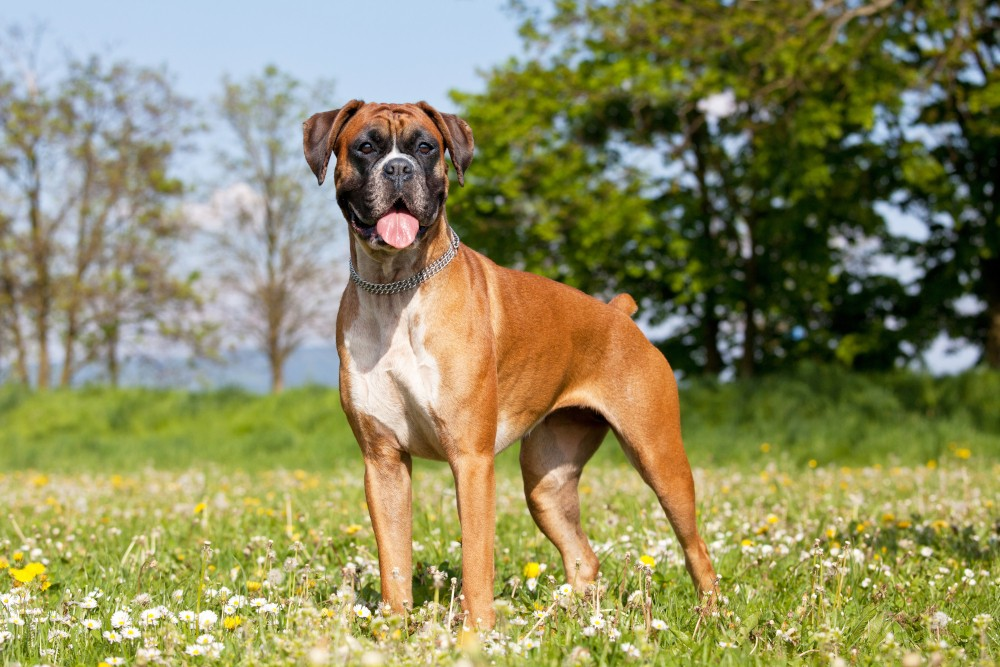

<link rel="stylesheet" href="style.css" />

# Piesek
Co to za pies? [^1]

Dużo więcej informacji można uzyskać na stronie *[Wikipedii](https://pl.wikipedia.org/wiki/Bokser_(rasa_psa))*

>To są naprawde fajne pieski

# Linki
[Tabela](#Tabela)

[Piesek](#Piesek)

# Tabela

|Kolumna 1|Kolumna 2|Kolumna 3|
|:---:|:---:|:---:|
|Element 1|Element 2|Element 3|
|Element 4|Element 5|Element 6|

[^1]:Bokser
